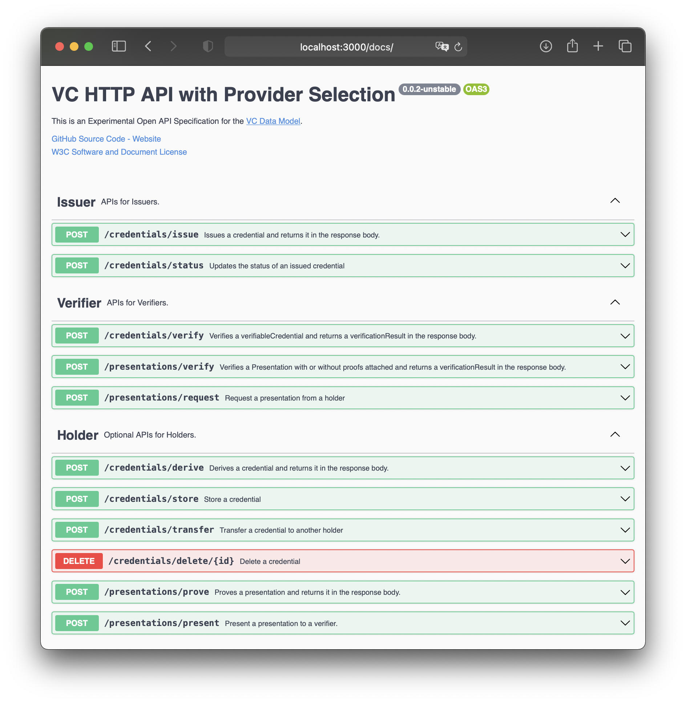
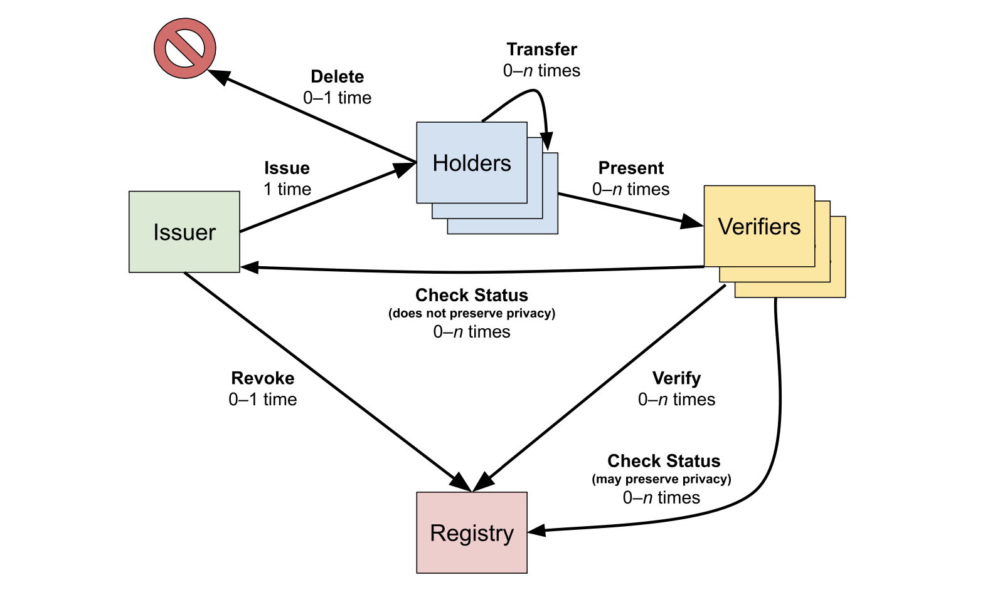

# Master's Thesis: Development of an Implementation-based Evaluation Framework for Verifiable Credential SDKs

## Goal

Current literature on SSI has only a small focus on developers. This [thesis](https://github.com/strumswell/ssi-master-thesis/blob/main/thesis/dist/ssi_master_thesis.pdf) gives developers a handful of useful tools to integrate SSI into their projects:
- 👀 Overview over 15 SSI solutions and their coverage of the Verifiable Credential lifecycle
- 🚀 Reference implementation for Mattr, Trinsic, Veramo and Azure AD for Verfiable Credentials
- 🧮 New evaluation framework covering functionality, flexibility, operability, dependency, and involvement

## Implementation

Comes as a RESTful API written in TypeScript using Express that implements the Verifiable Credential lifecycle of selected solutions. Based on the [vc-http-api](https://github.com/w3c-ccg/vc-http-api).

## Lifecycle Coverage

Shows, to what extend the solutions cover the Verifiable Credential lifecycle.
- Direct coverage: API exposes functionality to implement a percentage of the lifecycle
- General coverage: Includes direct coverage and abstracted steps of the lifecycle that is not exposed via an API

| Process Steps                               | MATTR | Veramo | Trinsic | Azure AD for VCs |
| ------------------------------------------- | :---: | :----: | :-----: | :----------------: |
| Direct Lifecycle Coverage                   |  60%  |   90%  |   40%   |  20%  |
| General Lifecycle Coverage                  |  90%  |   90%  |   90%   |  80%  |

## Results of Evaluation

Descriptions of all categories, criteria, and questions can be found in the [thesis](https://github.com/strumswell/ssi-master-thesis/blob/main/thesis/dist/ssi_master_thesis.pdf). All categories are normalized to have equal weight in the final score. Custom weights have to be applied by the developer dependeing on their use case.

| Category         | Mattr  | Veramo | Trinsic | Azure AD for VCs |
|------------------|--------|--------|---------|------------------|
| Functionality    | *93%*    | 65%    | 58%     | 38.83%           |
| Flexibility      | 25%    | *83.33%* | 41.67%  | 25%              |
| Operability      | *81.25%* | 35.43% | 72.92%  | 50%              |
| Dependency       | 20%    | *100%*   | 20%     | 20%              |
| Involvement      | *100%*   | *100%*   | *100%*    | *100%*             |
| **Normalized Score** | **63.85%** | **76.75%** | **58.52%**  | **46.77%**           |

