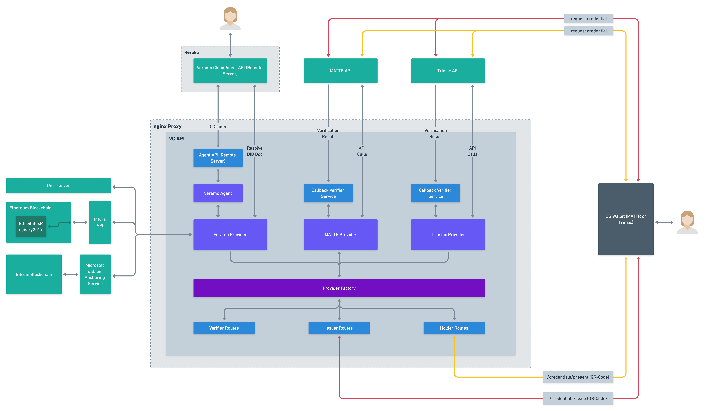

# Reference Implementation

## Goal

Create a RESTful API that implements the Verifiable Credential Lifecycle by leveraging the functionality of multiple providers (librarys, SDKs, platforms). Learnings from the implementation and results from the expert questionnaire are used to develop an evaluation framework for SDKs allowing to implement Verifiable Credentials.

## Architecture

The current architecure of the reference implementation can be seen below.

## Lifecycle Coverage

Implementation and coverage results (may change):

| Process Steps                               | MATTR | Veramo | Trinsic |
| ------------------------------------------- | :---: | :----: | :-----: |
| Issue /credentials/issue                    |  🟢   |   🟢   |   🟢    |
| Store /crendentials/store                   |  🟠   |   🟢   |   🟠    |
| Transfer /credentials/transfer              |  🔴   |   🟢   |   🔴    |
| Compose /credentials/prove                  |  🟢   |   🟢   |   🟠    |
| Present /presentations/present              |  🟠   |   🟢   |   🟠    |
| Request /presentations/request              |  🟢   |   🟢   |   🟢    |
| Verify /<credentials, presentations>/verify |  🟢   |   🟠   |   🟠    |
| Revoke /credentials/status                  |  🟢   |   🟠   |   🟢    |
| Delete /credentials/delete                  |  🟢   |   🟢   |   🟢    |
| Derive /credentials/derive                  |  🟠   |   🔴   |   🟠    |
| Indirect Coverage Score (ICS)               | 90 %  |  90 %  |   90%   |
| Weighted Indirect Coverage Score (WICS)     | 75 %  |  80 %  |   65%   |
| Direct Coverage Score (DCS)                 | 60 %  |  70 %  |   40%   |

The api specification is roughly based on the [vc-http-api](https://github.com/w3c-ccg/vc-http-api).
